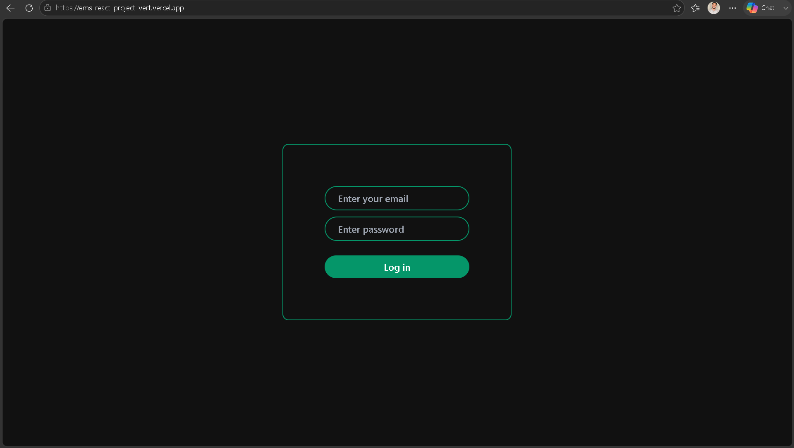
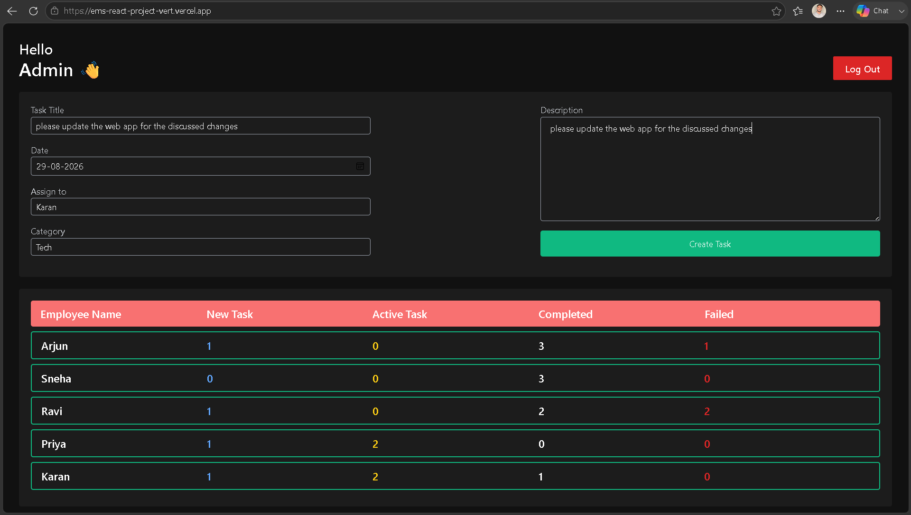
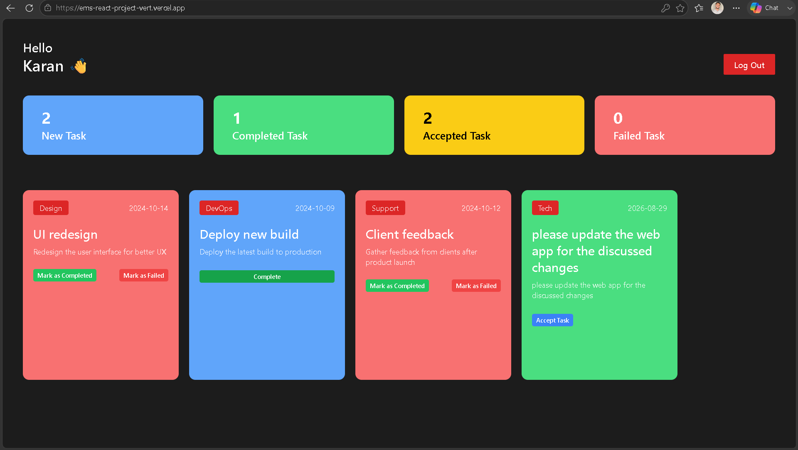
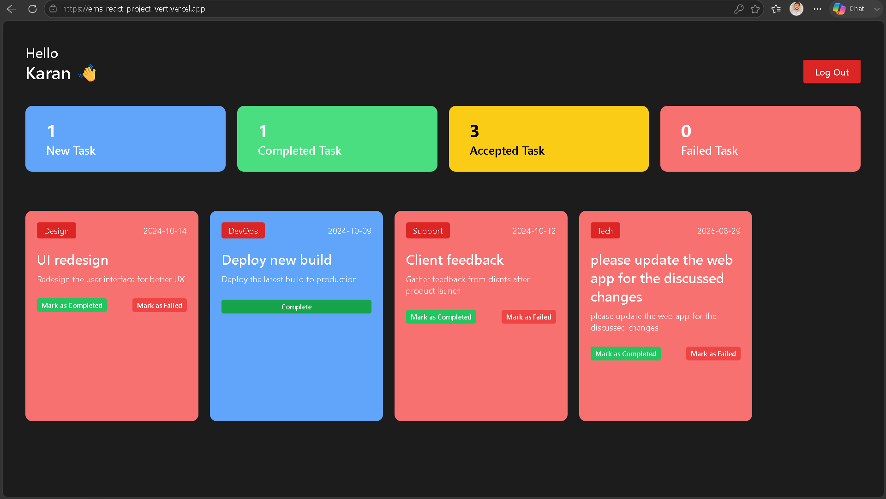
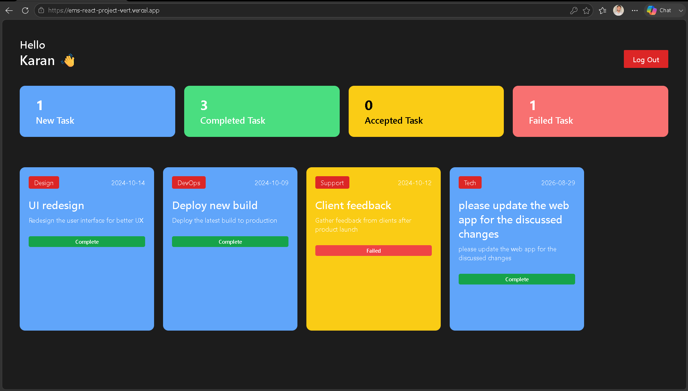

# Employee Management System

A modern **Employee Management System** built with React, designed to provide separate workflows for administrators and employees. The application allows administrators to create and assign tasks while employees can manage their assigned work and update task outcomes.

🔗 **Live Demo:** https://ems-react-project-vert.vercel.app
💻 **GitHub Repository:** https://github.com/Akramb17/EMS-React-Project

---

## 🔑 Demo Credentials

Use the following credentials to explore the application:

### Admin

- **Email:** `admin@example.com`
- **Password:** `123`

### Employee

- **Email:** `employee2@example.com`
- **Password:** `123`

> These are demo credentials intended for testing the deployed application.

## ✨ Features

### 🔐 Sign-In

A dedicated sign-in interface provides access to the application and routes users into their respective workspace.

### 👨‍💼 Admin Dashboard

Administrators can:

* Create and assign tasks to employees
* Add task titles and descriptions
* Set task dates
* Select task categories
* Monitor employee task statistics
* Track new, accepted, completed, and failed tasks

### 👨‍💻 Employee Dashboard

Employees can:

* View assigned tasks
* Monitor task statistics
* Review task details
* Accept new tasks
* Mark accepted tasks as completed
* Mark tasks as failed
* View completed and failed tasks separately

### 📊 Task Management

The application follows a simple task lifecycle:

**New → Accepted → Completed / Failed**

This gives employees a clear workflow for managing assigned tasks while allowing administrators to monitor overall progress.

---

## 🛠️ Tech Stack

### Frontend

* **React 19**
* **JavaScript**
* **Vite**
* **Tailwind CSS 4**
* **HTML5**
* **CSS3**

### Development & Deployment

* **npm**
* **Git**
* **GitHub**
* **Vercel**

The repository configuration currently uses React 19, Vite 7, Tailwind CSS 4, ESLint, and the Tailwind Vite integration.

---

## 🖥️ Application Walkthrough

### 1. Sign-In Page

Users begin by signing into the application through the dedicated login interface.



---

### 2. Admin Dashboard

The administrator dashboard provides an overview of employee activity and task statistics.

Administrators can create new tasks by specifying the task details, selecting a category, setting a date, and assigning the task to an employee.



---

### 3. Employee Dashboard

After signing in as an employee, the employee dashboard provides an overview of the current task workload.

The dashboard separates tasks into:

* New Tasks
* Completed Tasks
* Accepted Tasks
* Failed Tasks



---

### 4. Accepting and Managing Tasks

Employees can review newly assigned tasks and accept them. Once a task has been accepted, the employee can choose to mark it as completed or failed.



---

### 5. Task Status Tracking

The dashboard reflects updated task states, allowing employees to distinguish between completed and failed tasks.



---

## 🔄 Application Workflow

```text
                    ┌──────────────┐
                    │   Sign-In    │
                    └──────┬───────┘
                           │
              ┌────────────┴────────────┐
              │                         │
              ▼                         ▼
      ┌───────────────┐         ┌──────────────────┐
      │     Admin     │         │     Employee     │
      │   Dashboard   │         │     Dashboard    │
      └───────┬───────┘         └────────┬─────────┘
              │                          │
              ▼                          ▼
       Create & Assign             View New Tasks
            Tasks                       │
                                        ▼
                                  Accept Task
                                        │
                              ┌─────────┴─────────┐
                              │                   │
                              ▼                   ▼
                         Completed             Failed
```

---

## 📁 Project Structure

```text
EMS-React-Project/
│
├── public/
│   └── ems.svg
│
├── src/
│   ├── components/
│   ├── context/
│   ├── utils/
│   └── ...
│
├── .eslintrc.cjs
├── eslint.config.js
├── index.html
├── package.json
├── package-lock.json
├── postcss.config.js
├── tailwind.config.js
├── vite.config.js
└── README.md
```

The repository currently contains separate `public` and `src` directories along with the Vite, Tailwind, ESLint, and package configuration files.

---

## ⚙️ Getting Started

### Prerequisites

Make sure you have the following installed:

* Node.js
* npm
* Git

### Clone the Repository

```bash
git clone https://github.com/Akramb17/EMS-React-Project.git
```

### Navigate to the Project

```bash
cd EMS-React-Project
```

### Install Dependencies

```bash
npm install
```

### Start the Development Server

```bash
npm run dev
```

Vite will provide the local development URL in the terminal.

---

## 📦 Available Scripts

### Development

```bash
npm run dev
```

Starts the Vite development server with hot module replacement.

### Production Build

```bash
npm run build
```

Creates an optimized production build.

### Preview

```bash
npm run preview
```

Runs a local preview of the production build.

### Lint

```bash
npm run lint
```

Runs ESLint across the project.

These scripts are defined in the project's current `package.json`.

---

## ☁️ Deployment

The application is deployed using **Vercel**.

### Live Application

https://ems-react-project-vert.vercel.app

The live deployment is also linked from the GitHub repository.

---

## 🎯 Project Focus

This project focuses on building a practical task-management workflow using React, including:

* Component-based UI development
* Separate admin and employee workflows
* Task creation and assignment
* Task state management
* Dashboard-based task tracking
* Responsive frontend development
* Modern utility-first styling with Tailwind CSS

---

## 🔮 Future Improvements

Potential future enhancements include:

* Backend API integration
* Persistent database storage
* Secure authentication
* Role-based authorization
* Employee management CRUD operations
* Notifications for newly assigned tasks
* Advanced task filtering and search
* Analytics and reporting
* Improved accessibility

---

## 👤 Author

### Akram Bhura

**GitHub:** https://github.com/Akramb17
**LinkedIn:** https://www.linkedin.com/in/akram-bhura-760602288/
**Email:** [akrambhura11@gmail.com](mailto:akrambhura11@gmail.com)

---

## 📄 License

This project is intended for educational and portfolio purposes.
